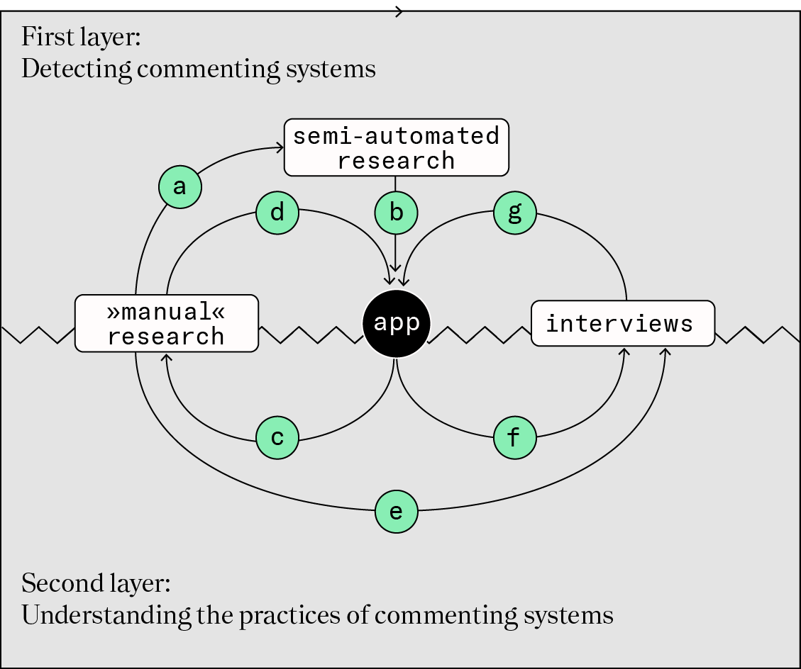

# Historische Technografie des Online-Kommentars

## Project description

The project researches the history of online commenting since the early 1990s. It develops and uses tools to sample data from the Internet Archive and conducts interviews with producers, users and other web actors that can help to reconstruct a transformation of practices and technologies of online commenting. The project examines three popularization dynamics within that context:

1. The (semi-) automation of text production, quantitative rankings and community management,
2. the aestheticization of quantities, activities and text-paratext relations and
3. the platformization of commenting systems and the resulting oligopolies.

This is research project is part of the CRC Transformation of the Popular. The website of the project can be found [here] 
(https://sfb1472.uni-siegen.de/forschung/popularisierung/historische-technografie-des-online-kommentars). This is the place to find all publications.

## Research approach

## Data

Some context to the datasets.

We will not provide a download link for the data, but publish an index of all sites analysed.

The links to the pages can be found here:
[World]()
[Dutch]()
[German]()

## App

As shown at the figure above, the app is a central hub in this research architecture. 

It is used for:
- displaying the results from the automated research (b)
- informing qualitative research about the gaps in the data (c)
- offers an interface to add findings from qualitative research and interviews (d, g)
- enables to raise questions to be asked in the interviews (f)

